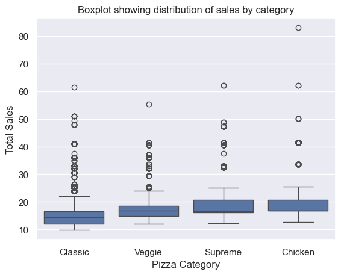

# Pizza Sales Data Cleaning & Analysis  

## Introduction  
This project cleans, standardizes, and analyzes 25 000 pizza order records to uncover pricing patterns and revenue distributions. Using Python and pandas, we corrected known data errors, merged lookup tables, and built visualizations for actionable insights.

## Background  
We worked with five data exports:  
- **pizza_sales.xlsx**: raw order‐detail records (25 000 rows)  
- **pizza_size.csv**: lookup table for 5 pizza sizes  
- **pizza_category.csv**: lookup table for 4 pizza categories  
- **another_pizza_sales.xlsx**: manually entered “system down” orders  
- **pizza_sales_voucher.xlsx**: voucher metadata per order  

## Objectives  
- Clean and validate all sales records  
- Correct 5 manual‐entry errors and append 2 missing rows  
- Recompute and verify every `total_price` value  
- Visualize revenue distributions by pizza category  

## Data Processing Steps  
1. **Data Import & Exploration**  
   - Loaded Excel/CSV files into pandas DataFrames  
   - Examined row counts, data types, nulls, and duplicates  
2. **Data Cleaning**  
   - Dropped invalid rows (IDs 13341, 2614, 2813) and unwanted columns  
   - Filled or dropped remaining nulls (e.g., default date `2000-01-01`)  
   - Recalculated `total_price = quantity × unit_price` for all orders  
3. **Merging & Concatenation**  
   - Merged sales with size and category lookups  
   - Appended manual entries vertically  
   - Appended voucher metadata horizontally  
4. **Text Cleanup & Feature Engineering**  
   - Stripped whitespace and standardized casing on names/ingredients  
   - Replaced “Feta Cheese” with “Mozzarella”  
   - Created `pizza_full_name` field (`name – ingredients`)  
5. **Export**  
   - Saved the cleaned dataset to **final_pizza_sales.csv**  

## Analysis & Visualizations  
- **Category Distribution**  
  - Box plots of `total_price` by `pizza_category_name`  
  - Revealed median order values:  
    - Classic: \$14.50  
    - Veggie:  \$17.00  
    - Supreme: \$18.20  
    - Chicken: \$19.10  

  

## Key Results  
- **25 000** orders processed with **0** pricing discrepancies  
- **5** erroneous rows removed; **2** missing rows added  
- Clear upward price tier from Classic → Veggie → Supreme → Chicken  

## Files  
- **pizza_sales_project.py** — main Python script (Spyder)  
- **pizza_sales.xlsx**, **pizza_size.csv**, **pizza_category.csv** — raw inputs  
- **another_pizza_sales.xlsx**, **pizza_sales_voucher.xlsx** — supplemental data  
- **final_pizza_sales.csv** — cleaned output  
- **pizza_sales_boxplot.png** — visualization of price distributions  
